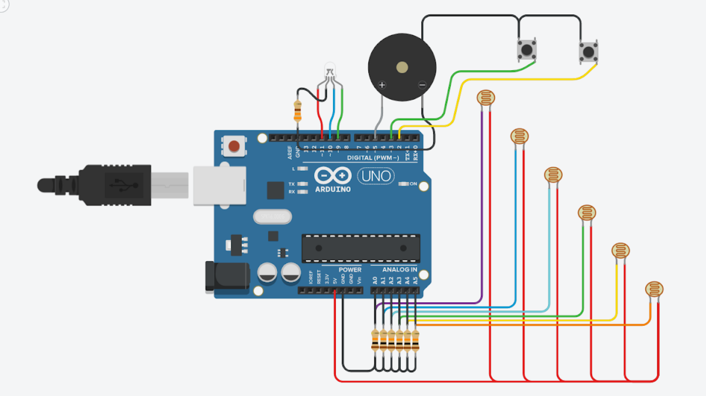
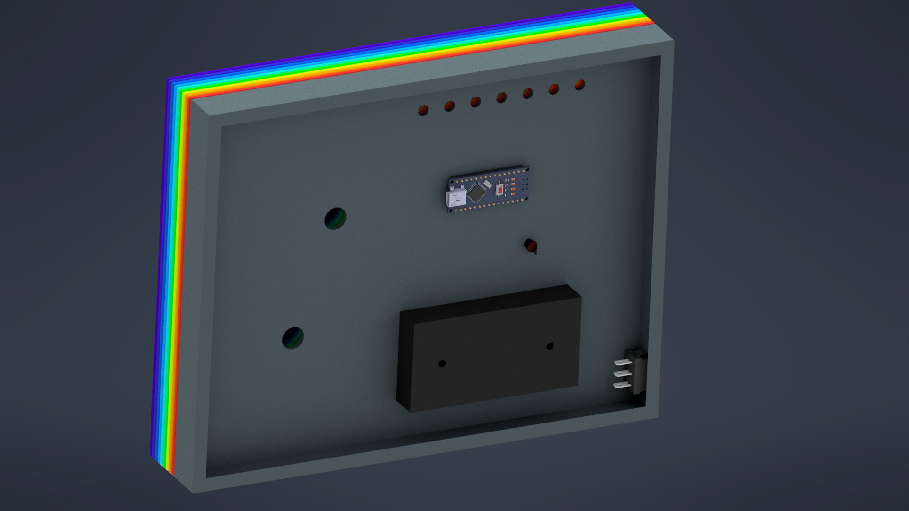

# Baby Engineer: Logic Gates

The book "Baby Engineer: Logic Gates" is designed to teach logic gates to kids and teenagers. It is especially appealing to kids with autism since it uses visual and auditory signs to keep their interest.

# Development

## Circuit

## 3D design

## Laser cut

# Delivery day

